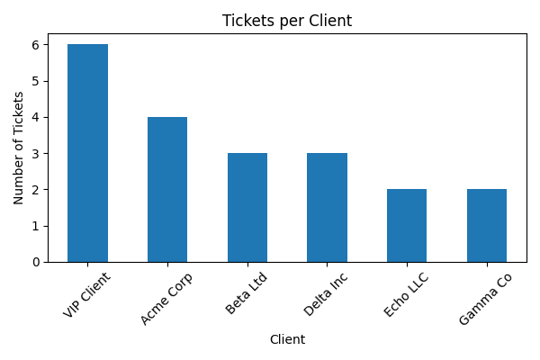
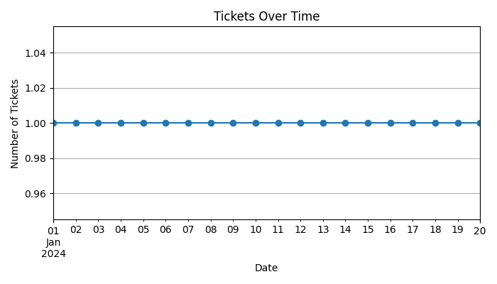
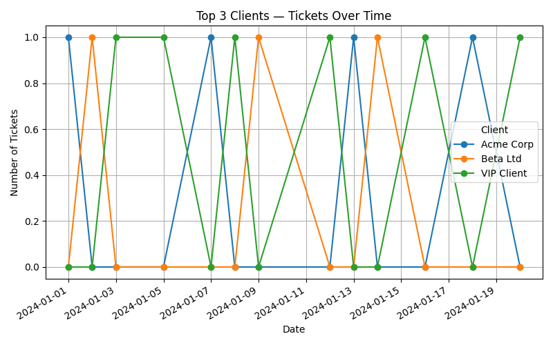

# ai-journey
my weekly learning projects from foundations to consulting ready

# AI Journey

This repository tracks my weekly AI learning projects as I transition from enterprise IT into AI consulting.  
All resources are **free**, **minimal math**, and focused on **practical business value**.

---

## Week 1 – AI Foundations & Business Impact

**What’s inside:**
- 📚 Links to free AI learning resources  
- ✍️ Exercise on AI opportunities in my industry  
- 🧪 Mini Python warm-up  
- 📊 Small dataset analysis & visualization  
- 💼 Business framing exercise  

---

## Week 2 – Python Basics for AI

**What’s inside:**
- Variables, data types, lists, and dictionaries  
- Functions and loops  
- Basic analysis with Python  
- Simple matplotlib chart  
- Two KPI functions: `sla_breaches` and `throughput`  
- Bonus: Tiny text cleanup  

---

## Week 3 – Data Handling & Visualization

**What’s inside:**
- Load, clean, and inspect datasets with pandas  
- Filter, search, sort, and combine conditions  
- Visualize trends (per client, priority, status, over time)  
- Export filtered views to CSV
---

### Sample Visuals

## Week 4 – Intro to Machine Learning

**What’s inside:**
- Load built-in dataset (California Housing)  
- Select features & target variable  
- Train/test split  
- Train Linear Regression model  
- Evaluate with MAE and R² score  
- Visualize predictions vs actual  
- Bonus: Try a different model 

---

## Week 5 – Classification Models

**What’s inside:**
- Binary classification with Logistic Regression  
- Try a tree-based model (Random Forest)  
- Metrics: Accuracy, Precision, Recall, F1, ROC AUC  
- Visuals: Confusion Matrix & ROC Curve  
- Business interpretation of trade-offs  
- Bonus: Threshold tuning

---

## How to Use
1. Click the **Open in Colab** button for the week you want to work on.  
2. Run each cell in order (Shift + Enter).  
3. Save a copy to your Google Drive to keep your changes.

---

## Progress
- ✅ Week 1: AI Foundations & Business Impact  
- ✅ Week 2: Python Basics for AI  
- ✅ Week 3: Data Handling & Visualization  
- ✅ Week 4: Intro to Machine Learning  
- ✅ Week 5: Classification Models  

